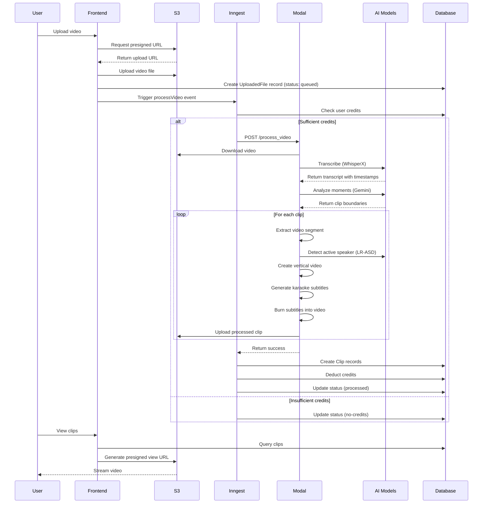

#  Clipzz Architecture

This document provides a comprehensive overview of Clipzz's system architecture, data flow, and component interactions.

##  System Overview

Clipzz is a full-stack AI-powered SaaS application built as a monorepo with clear separation between frontend and backend concerns.

```
        ┌─────────────┐
        │   Browser   │
        └──────┬──────┘
               │
               ↓
┌───────────────────────────────────┐
│     Frontend (Next.js 15)         │
│   - App Router Pages              │
│   - Server Actions                │
│   - NextAuth.js Authentication    │
└──────────────┬────────────────────┘
               │
               ↓
         ┌─────────────┐
         │   Inngest   │  Background Job Queue
         └──────┬──────┘
                │
                ↓
        ┌────────────────┐
        │  Modal Backend │  Serverless GPU (L40S)
        │  (FastAPI)     │
        └────────┬───────┘
                 │
        ┌────────┴────────┐
        ↓                 ↓
  ┌─────────┐      ┌───────────┐
  │   S3    │      │ AI Models │
  │ Storage │      │- WhisperX │
  └─────────┘      │- Gemini   │
                   │- LR-ASD   │
                   └───────────┘
```

##  Data Flow

### Complete Processing Pipeline



### Step-by-Step Breakdown

#### 1. Video Upload 
```
User → Dashboard → generateUploadUrl() → S3 Presigned URL → Direct Upload
```
- User drags video into upload zone
- Frontend calls `generateUploadUrl()` server action
- Server generates UUID-based S3 key: `{userId}/{uuid}/{filename}`
- Returns presigned URL (valid for 600 seconds)
- Client uploads directly to S3 (no server bottleneck)
- Database record created with `status: "queued"`, `uploaded: false`

#### 2. Processing Initiation 
```
Dashboard → processVideo() → Inngest Event → Background Job
```
- User clicks "Process" button with desired number of clips
- `processVideo()` server action:
  - Checks if already uploaded
  - Sends `video/process` event to Inngest
  - Updates `uploaded: true` in database
- Inngest queues job with:
  - Concurrency limit: 1 per user
  - Single retry on failure

#### 3. Credit Validation 
```
Inngest → Database → Check Credits → Proceed or Fail
```
- Query user's current credit balance
- Check if `credits >= numClips`
- If insufficient:
  - Update status to `"no-credits"`
  - Stop processing
- If sufficient: continue to Modal

#### 4. Transcription 
```
Modal → Download from S3 → WhisperX → Word-Level Timestamps
```
- **Model:** WhisperX large-v2
- **Input:** Video file (audio extracted)
- **Process:**
  - Automatic language detection
  - Speech-to-text transcription
  - Word-level timestamp alignment
  - Hindi: Devanagari → Roman transliteration
- **Output:** JSON with segments
  ```json
  {
    "segments": [
      {
        "start": 10.5,
        "end": 15.2,
        "text": "This is an example",
        "words": [
          {"word": "This", "start": 10.5, "end": 10.8},
          {"word": "is", "start": 10.9, "end": 11.0}
        ]
      }
    ]
  }
  ```

#### 5. Moment Identification 
```
Transcript → Gemini 2.5 Pro → Analyze → Return Clip Boundaries
```
- **Model:** Google Gemini 2.5 Pro
- **Prompt:** Identify engaging Q&A moments
- **Constraints:**
  - 30-60 seconds per clip
  - No overlapping clips
  - Exclude greetings/intros
- **Output:** JSON array
  ```json
  [
    {
      "clip_number": 1,
      "start_seconds": 125.0,
      "end_seconds": 178.0,
      "description": "Discussion about AI in education"
    }
  ]
  ```

#### 6. Active Speaker Detection 
```
Video Segment → LR-ASD → Face Tracking → Speaker Scores
```
- **Model:** LR-ASD (Light-Weight Active Speaker Detection)
- **Paper:** CVPR 2023
- **Process:**
  - Detect faces in each frame
  - Track faces across frames
  - Score each face for "speaking" activity
  - Output pickle files with tracks and scores
- **Output:**
  - `pyframes/{frame_number}.jpg` - Frames with bounding boxes
  - `tracks.pckl` - Face track data
  - `scores.pckl` - Per-frame speaking scores

#### 7. Vertical Video Creation 
```
Horizontal Video → Smart Crop/Resize → 1080x1920 Vertical
```
- **Target Resolution:** 1080x1920 (9:16 aspect ratio)
- **Two Modes:**

  **A. Crop Mode (Active Speaker Detected):**
  ```
  1. Calculate average speaking score over 60-frame window
  2. Identify highest-scoring face (active speaker)
  3. Get face bounding box coordinates
  4. Crop 1080-width region centered on speaker
  5. Resize to 1080x1920
  ```

  **B. Resize Mode (No Speaker / Multiple Speakers):**
  ```
  1. Resize video maintaining aspect ratio
  2. Add blurred background for letterboxing:
     - Duplicate frame
     - Apply Gaussian blur (99x99 kernel)
     - Overlay resized video in center
  ```

- **Performance:** GPU-accelerated with `ffmpegcv.VideoWriterNV`

#### 8. Subtitle Generation 
```
Transcript → Group Words → Karaoke Timing → ASS Format → Burn-In
```
- **Format:** ASS (Advanced SubStation Alpha)
- **Grouping:** 5 words per subtitle line
- **Positioning:** Bottom center (Alignment=2)
- **Styling:**
  - Font: Anton, 140pt
  - Colors: White text (&HFFFFFF&), Yellow highlight (&H00FFFF&)
  - Effects: Shadow (2px) + Outline (3px)
- **Karaoke Effect:** `\k` tags for word-by-word timing
  ```
  {\k50}Word1 {\k30}Word2 {\k40}Word3
  ```
  - Numbers are centiseconds (50 = 0.5 seconds)
  - Highlighted word changes color from white to yellow
- **Burn-In:** ffmpeg subtitles filter

#### 9. Storage & Delivery 
```
Processed Clip → Upload to S3 → Create DB Record → Presigned URL → User
```
- Clips stored: `{userId}/{uploadId}/clip_{index}.mp4`
- Database `Clip` records created with S3 keys
- User views clips via presigned URLs (3600s expiry)

##  Component Architecture

### Frontend Components

#### App Router Structure
```
src/app/
├── page.tsx                    # Landing page
├── dashboard/
│   ├── page.tsx               # Main dashboard
│   └── billing/
│       └── page.tsx           # Payment page
├── api/
│   └── webhooks/
│       ├── stripe/route.ts    # Stripe webhook handler
│       └── razorpay/route.ts  # Razorpay webhook handler
└── inngest/route.ts           # Inngest API endpoint
```

#### Server Actions (`src/actions/`)
- **`auth.ts`:** Sign up, sign in, sign out
- **`s3.ts`:** Presigned URL generation for uploads
- **`generate.ts`:** Process video, get clip playback URLs
- **`stripe.ts`:** Create Stripe checkout sessions
- **`razorpay.ts`:** Create Razorpay checkout sessions

#### React Components (`src/components/`)
- **`dashboard-client.tsx`:** Main dashboard UI (file upload, queue table, clips gallery)
- **`login-form.tsx`:** Email/password login
- **`signup-form.tsx`:** User registration
- **`clip-card.tsx`:** Individual clip display with video player

#### Background Jobs (`src/inngest/`)
- **`processVideo`:** Orchestrates entire processing pipeline
  - Step 1: Credit validation
  - Step 2: Call Modal endpoint
  - Step 3: Poll S3 for completion
  - Step 4: Create clip records
  - Step 5: Update status

### Backend Components

#### Modal App (`backend/main.py`)
```python
app = modal.App("clipzz-video-processor")

# Persistent volume for model caching
volume = modal.Volume.from_name("clipzz-models")

# Custom CUDA image with dependencies
image = (
    modal.Image.debian_slim(python_version="3.12")
    .apt_install(["ffmpeg", "git", ...])
    .pip_install(["torch==2.4.1+cu124", ...])
    .run_commands([...])
)

@app.function(
    gpu="L40S",
    timeout=900,
    image=image,
    volumes={"/root/.cache": volume}
)
```

#### Core Functions
| Function | Purpose | Input | Output |
|----------|---------|-------|--------|
| `transcribe_video()` | WhisperX transcription | Video path | Transcript JSON |
| `identify_moments()` | Gemini clip selection | Transcript | Clip boundaries |
| `process_clip()` | Single clip processing | Video + timestamps | Clip file |
| `create_vertical_video()` | Format conversion | Frames + scores | Vertical MP4 |
| `create_subtitles_with_ffmpeg()` | Subtitle generation | Transcript + timing | Video with subs |

### Database Schema

```prisma
model User {
  id                String   @id @default(cuid())
  email             String   @unique
  name              String?
  credits           Int      @default(10)
  razorpayContactId String?
  uploadedFiles     UploadedFile[]
  clips             Clip[]
  accounts          Account[]
  sessions          Session[]
}

model UploadedFile {
  id          String   @id @default(cuid())
  userId      String
  filename    String
  s3Key       String
  status      String   @default("queued")  // queued | processing | processed | no-credits | failed
  uploaded    Boolean  @default(false)
  numClips    Int      @default(1)
  user        User     @relation(fields: [userId], references: [id])
  clips       Clip[]
  createdAt   DateTime @default(now())
}

model Clip {
  id              String       @id @default(cuid())
  userId          String
  uploadedFileId  String
  s3Key           String
  clipIndex       Int
  user            User         @relation(fields: [userId], references: [id])
  uploadedFile    UploadedFile @relation(fields: [uploadedFileId], references: [id])
  createdAt       DateTime     @default(now())
}
```

##  Technology Choices & Rationale

### Why Next.js 15?
- **App Router:** Modern React architecture with server components
- **Server Actions:** Type-safe API calls without REST endpoints
- **Edge-Ready:** Fast global deployment on Vercel
- **Full-Stack:** Frontend + API in one framework

### Why Modal?
- **Serverless GPU:** Pay-per-second GPU access (no idle costs)
- **L40S GPU:** Powerful enough for WhisperX + PyTorch inference
- **Auto-Scaling:** Handles traffic spikes automatically
- **Model Caching:** Persistent volumes speed up cold starts
- **Simple Deployment:** `modal deploy` - no Kubernetes complexity

### Why WhisperX?
- **Accuracy:** State-of-the-art transcription (large-v2 model)
- **Word-Level Alignment:** Essential for karaoke subtitles
- **Multi-Language:** Supports English, Hindi, and 80+ languages
- **Fast:** Optimized for GPU inference

### Why Gemini 2.5 Pro?
- **Context Window:** 1M tokens (can analyze full podcast transcripts)
- **Structured Output:** Reliable JSON responses
- **Reasoning:** Better at identifying "engaging" moments vs simpler models
- **Cost-Effective:** Cheaper than GPT-4 for long content analysis

### Why LR-ASD?
- **Lightweight:** Runs efficiently on GPU
- **Accurate:** 96.4% F1 score on TalkSet dataset
- **Face Tracking:** Maintains identity across frames
- **Research-Backed:** CVPR 2023 paper

### Why Inngest?
- **Reliability:** Built-in retries and error handling
- **Observability:** Dashboard shows job status and logs
- **Concurrency Control:** Prevents overwhelming Modal
- **Serverless:** No queue infrastructure to maintain

### Why Prisma?
- **Type Safety:** Auto-generated TypeScript types
- **Developer Experience:** Intuitive schema and query API
- **Migrations:** Version-controlled database changes
- **Multi-Database:** Easy to switch from SQLite to PostgreSQL

##  Limitations & Considerations

### Current Limitations
1. **SQLite in Production:** Not suitable for high concurrency (migrate to PostgreSQL)
2. **No Real-Time Updates:** User must refresh to see clip status
3. **Single Region S3:** Higher latency for global users
4. **Fixed Subtitle Style:** No customization options yet
5. **No Preview:** Can't preview clips before purchasing

### Scalability Considerations
- **Modal Auto-Scaling:** Handles processing load automatically
- **S3 Storage Costs:** Monitor storage usage as user base grows
- **Database Connections:** Implement connection pooling for PostgreSQL
- **API Rate Limits:** Gemini API has rate limits (implement exponential backoff)

### Security Considerations
- **S3 Presigned URLs:** Expire after 1 hour (prevent unauthorized sharing)
- **Webhook Verification:** All payment webhooks verify signatures
- **Modal Auth:** Bearer token required for API access
- **SQL Injection:** Prisma ORM prevents injection attacks
- **Password Storage:** bcrypt with 12 rounds

##  Future Architecture Improvements

### Short-Term
- [ ] Add WebSocket for real-time progress updates
- [ ] Implement CDN (CloudFront) for faster video delivery
- [ ] Add Redis for caching presigned URLs
- [ ] Migrate to PostgreSQL for production

### Medium-Term
- [ ] Multi-region S3 buckets
- [ ] Video preview generation (thumbnail + 10s preview)
- [ ] Batch processing queue optimization
- [ ] Implement application-level caching (Gemini responses)

### Long-Term
- [ ] Microservices architecture for horizontal scaling
- [ ] ML model fine-tuning on user feedback
- [ ] Real-time collaboration features
- [ ] Mobile app (React Native)

---

For more details on specific components:
- **[Database Schema](DATABASE.md)** - Detailed schema documentation
- **[API Reference](API.md)** - Complete API documentation
- **[Backend README](backend/README.md)** - Processing pipeline deep-dive
